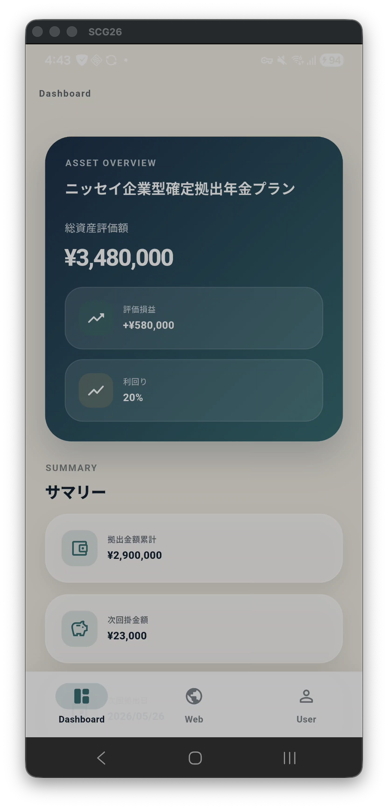
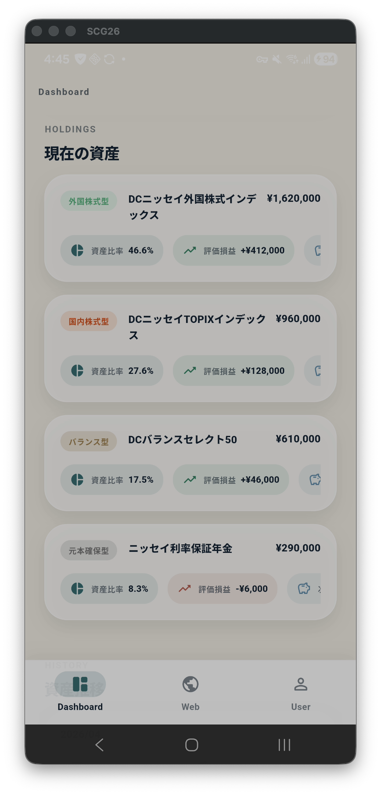

  

# NISSAY 401k

ニッセイの企業型確定拠出年金情報を、スマートフォンから見やすく確認するためのアプリです。

---

## ✨ Overview

**NISSAY 401k** は、企業型確定拠出年金の情報を  
**シンプルに・見やすく・すぐ確認できる** ことを目指したモバイルアプリです。

ログイン後は、資産状況の確認、内訳のチェック、推移の把握、  
さらに必要に応じて Web 画面の利用まで、ひとつのアプリ内でスムーズに行えます。

---

## 📱 Screenshots

<table>
  <tr>
    <td align="center">
      
    </td>
    <td align="center">
      
    </td>
  </tr>
</table>

---

## 🌟 Features

- **🔐 かんたんログイン**
- **📊 資産状況をひと目で確認**
- **🧾 保有商品の内訳をチェック**
- **📈 資産推移をふりかえる**
- **👤 アカウント情報を確認**
- **🔄 セッション更新・ログアウト**
- **🌐 Web画面もそのまま利用**
